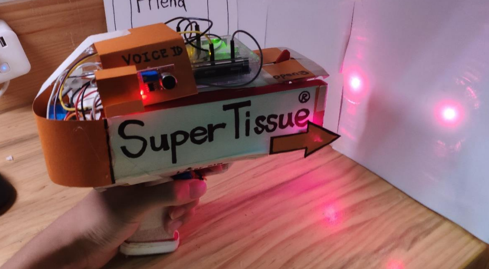
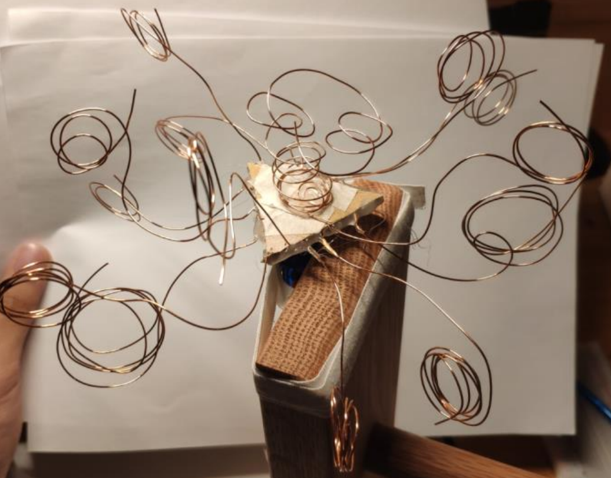
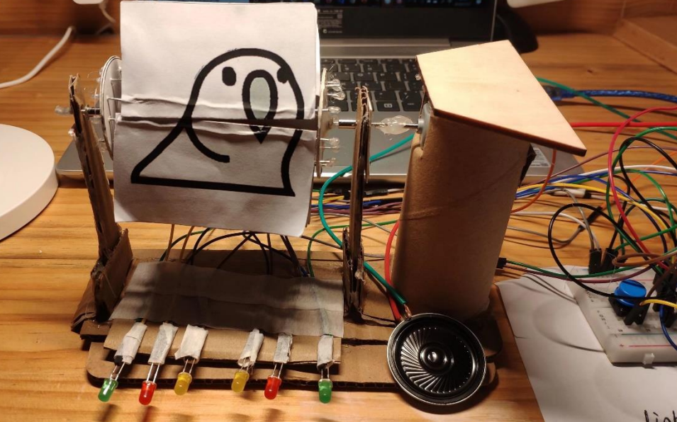

# Introductory_Interaction_Design_projects

This folder includes some toy projects which was created in my freshman year. 

The are related to the course *ARTS1409 Introductory Interaction Design* taught by [Prof. Hiroki NISHINO](https://www.hnishino.com/about/). Thanks for his instructions!

In the course we are not allowed to use ```C++``` and can only use the visual programming language designed by the professor, which called [Ardestan](https://www.hnishino.com/2019/05/09/ardestan-a-visual-programming-language-for-arduino/). The main target of the course is emphasized on teaching the design procedure.

Although these projects are very naïve and simple, I still show them here in that they are quite interesting and  memorable.

---






