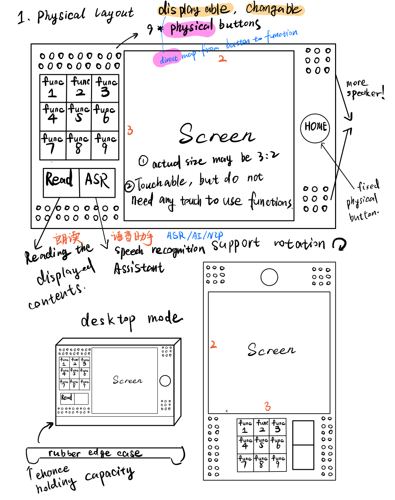
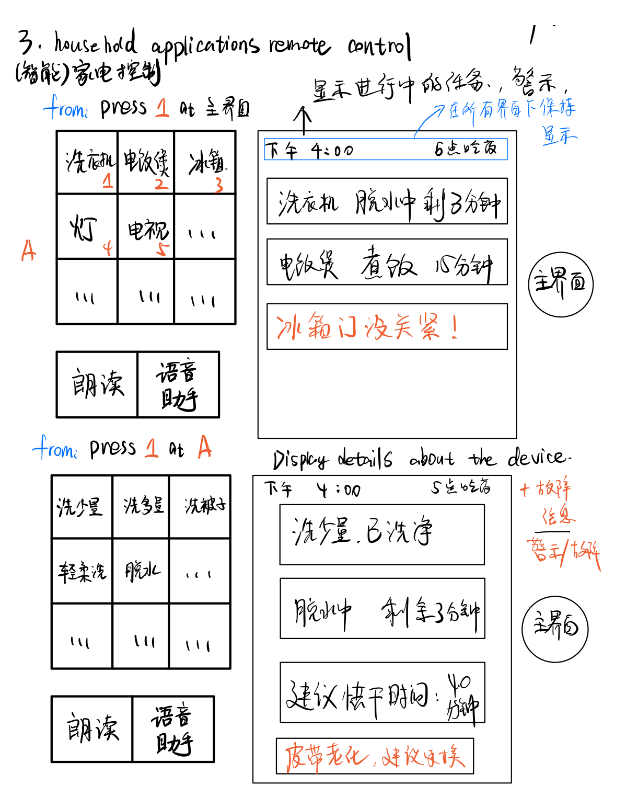
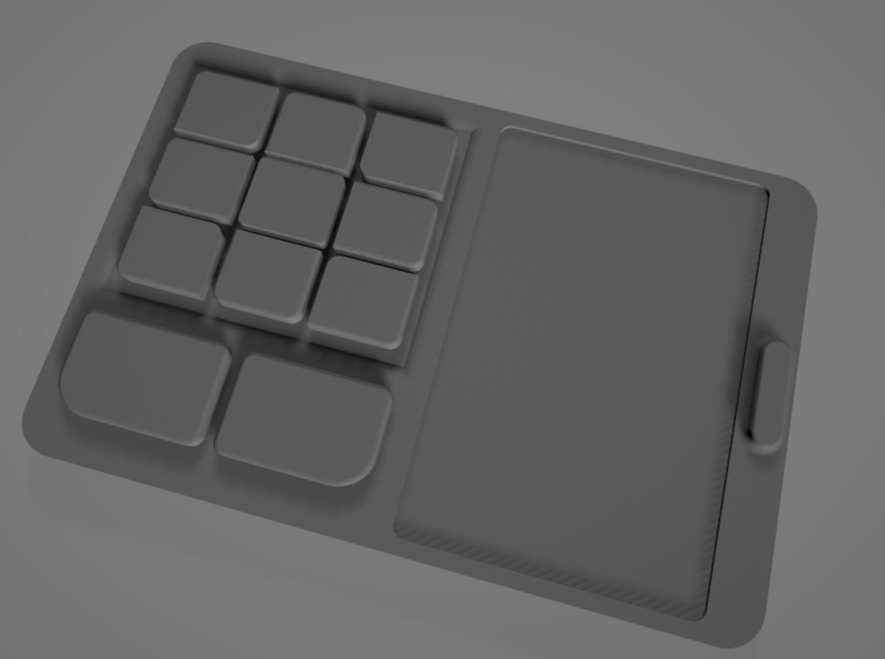
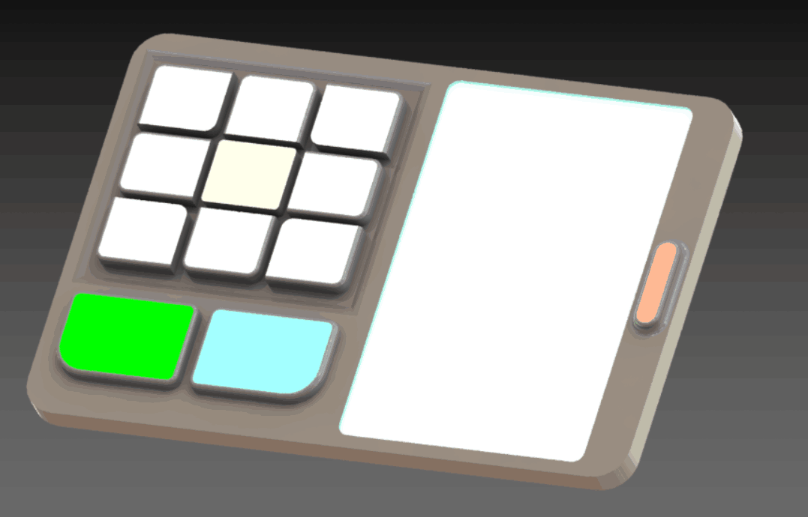
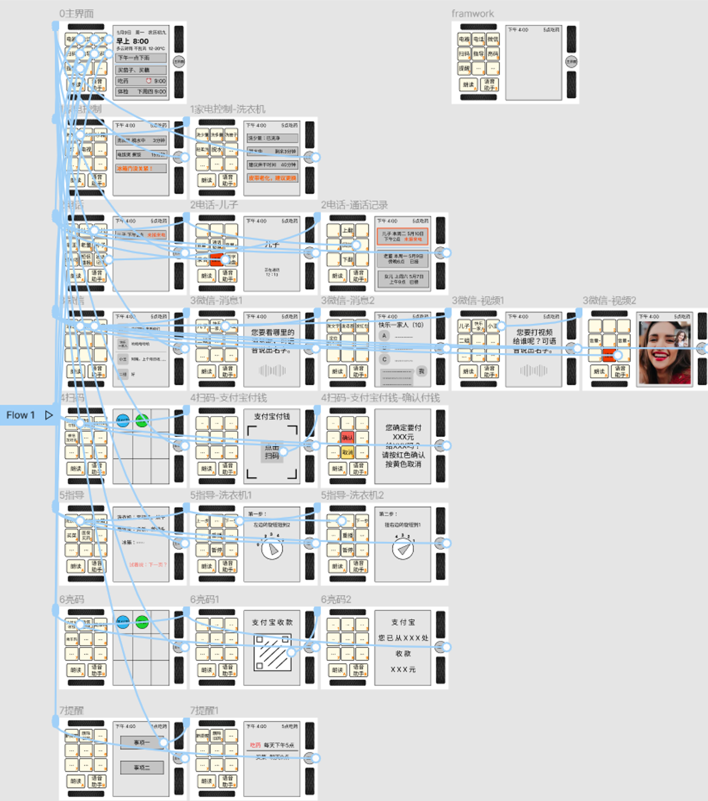
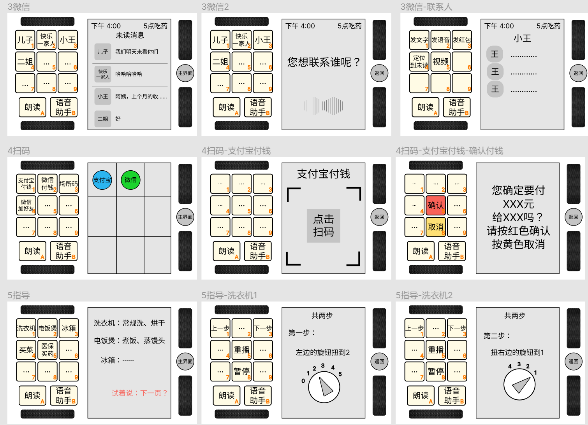

# CS160_Human-Computer_Interaction
shanghaitech ***CS160 Human-Computer Interaction*** project &   
shanghaitech ***ARTS1409 Introductory Interaction Design*** mini projects

## Introduction
This repository includes project files for CS160 in shanghaitech and my other HCI-related projects.   

This CS160 project aims to design an All-in-One solution for the elderly, especially those who can not use mobile phones and modern smart home appliances (washing machines, televisions, etc.) for different reasons like aging, vision loss, and confusion about the complex interfaces.  

This solution is defined as a specially designed, pad-like device, having both a touch screen and **Physical Buttons** which is highly demanded by certain elderly group, according to interviews and surveys. These buttons are displayable, being able to show and short text contents and colors with small screens inside them.

It Integrates the basic functions (of the smartphone and appliance controllers) that are highly needed by the elderly in China:

- a. Home appliance controlling and related information notices.

- b. An interface - simplified version of WeChat (a social application )   and other interface - simplified, social functions, like phone calling and text messages.

- c. Reminders about the daily routines. ( e.g. taking medicines)

- e. Payment QR code showing and code scanning

- f. A 'step instructor that can help the elderly operate certain appliance step by step

## Concepts

- Pick **core functions** of the appliance and repackage them into **one-click** style

- Make the **interface** extremely simple, at most 2 layers

- Make the** logic** extremely simple, less input demand, more yes-and-no style

- Use **mixed multimodal input and output**: Voice, displayable Button with screens

- All the design short be straight-forward in **elderly's Cognitive model**, not ours

- **Dumb-Smart** device: Smart in functions, dumb in operations

## Procedure

This project follows the general procedure of HCI research:

1. Need finding :

   - Questionnaires and surveys about what are the major problems and needs the elderly have in using mobile phones and home appliances

   - Interviews with the typical aged people we found.
   - User portrait and Cognitive model of the targeted aged people group

2. Low-fi model :

   - Decide the content and range of the low-fi model of the interfaces of the functions
   - Paper model, Hand drawing interfaces

3. Testing :
   - Wizard of Oz experiment with users
   - Survey (after-test)

4. Mid-fi model:

   - [figma model](https://www.figma.com/file/snT0iK8hPYLoF79no4J55D/Mid-fi?node-id=0%3A1) of the interfaces for all functions
   - CAD models made with ```SOLIDWORKS``` for 3D print
   - Concept Video

5. Testing 2: 

   - Usability Testing with users (10 Usability Heuristics)
   - Wizard of Oz experiment with users
   - HCI_POV reflections
## Hierarchy

|  folder name  | content                                                                       |
|  -----------  | ----------------------------------------------------------------------------- |
| text_records  | questionnaires, survey outcomes, interview records, evaluations, idea records |
| presentations | presentation ppts per stage                                                   |
| models        | CAD models, low-fi model, mid-fi model                                        |
| Image_gallery | full image gallery                                                            |
| Assignments   | other assignments of CS160                                                    |
| ARTS1409      | personal mini projects of ARTS1409                                            |

The folder ```\ARTS1409_Introductory_Interaction_Design``` includes my personal mini projects done in that course during my freshman year. Check the other ```README.md``` there for more information.
```
📦CS160_Human-Computer_Interaction
 ┣ 📂ARTS1409_Introductory_Interaction_Design
 ┃ ┣ 📜Ardestan_Pre.pdf
 ┃ ┣ 📜Don_Norman_Excerpt.pdf
 ┃ ┣ 📜Final_project_‘Super Tissue’ tissue gun.pdf
 ┃ ┣ 📜Mini_project_ ZEN kinetic art sculpture.pdf
 ┃ ┣ 📜Mini_project_Dancing party parrot game.pdf
 ┃ ┗ 📜README.md
 ┣ 📂Assignments
 ┣ 📂Image_gallery
 ┣ 📂models
 ┃ ┣ 📜device_CAD_model.SLDPRT
 ┃ ┣ 📜device_stl_model.STL
 ┃ ┣ 📜low-fi model & principles.pdf
 ┃ ┣ 📜mid-fi.md
 ┃ ┣ 📜mid-fi.pdf
 ┃ ┗ 📜Mid-fi.png
 ┣ 📂presentations
 ┃ ┣ 📜01 opening_pdf.pdf
 ┃ ┣ 📜01 opening_ppt.pptx
 ┃ ┣ 📜01 opening_script.pdf
 ┃ ┣ 📜02 mid_pre_pdf.pdf
 ┃ ┣ 📜02 mid_pre_ppt.pptx
 ┃ ┣ 📜03 final_pre_pdf.pdf
 ┃ ┗ 📜03 final_pre_ppt.pptx
 ┣ 📂README.assets
 ┣ 📂text_records
 ┃ ┣ 📜elderly_Interview_record.pdf
 ┃ ┣ 📜HCI_POV.md
 ┃ ┣ 📜HCI_POV.pdf
 ┃ ┣ 📜ideatMindmap.png
 ┃ ┣ 📜Meeting1_BrainstormForTopic.pdf
 ┃ ┣ 📜Meeting2：topic_and_questionaire.pdf
 ┃ ┣ 📜mid-evaluation-design.pdf
 ┃ ┣ 📜Needfindng_questionaire.docx
 ┃ ┣ 📜Needfindng_questionaire_result.pdf
 ┃ ┣ 📜reflections.md
 ┃ ┣ 📜reflections.pdf
 ┃ ┣ 📜UEQ_questionnaire.pdf
 ┃ ┣ 📜usabilityTestFeedback.pdf
 ┃ ┗ 📜usabilityTestFeedback.xlsx
 ┗ 📜README.md
```

Only upload a part of all the information here. (Concept Video and Other video recordings not included)

## Gallery

Just some quick showing-up here, check the ```.\presentations``` , ```.\models``` , ```.\Image_gallery```and [figma model link](https://www.figma.com/file/snT0iK8hPYLoF79no4J55D/Mid-fi?node-id=0%3A1) for more details.

- low fi model and interface





- Mid-fi model and CAD model








