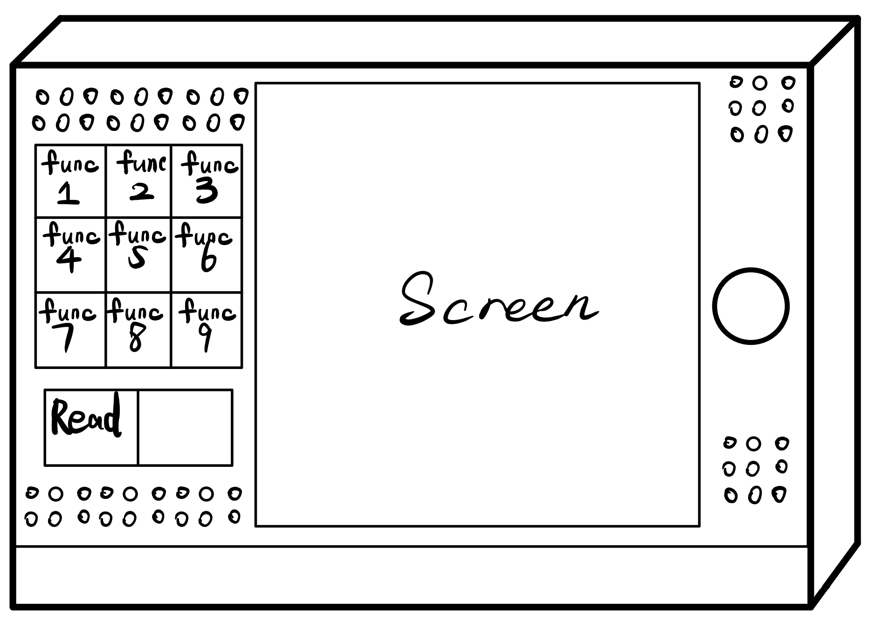

# CS160_Human-Computer_Interaction
shanghaitech CS160 Human-Computer Interaction project &
shanghaitech ARTS1409 Introductory Interaction Design mini projects

## Introduction
This repository includes project files for CS160 in shanghaitech and my other HCI related projects.

The CS160 project is targeted at designing a All-in-One solution for the elderly, especially those who can not use the mobile phones and modern smart home appliance (washing machine, televisions, etc.) because of different reasons like aging, vision loss, cofusion about the complex interfaces.


Only upload a part of all the information here. (Concept Video and Other video recordings not include)

The folder ```\ARTS1409_Introductory_Interaction_Design``` includes my personal mini projects done in that course during  my freshman year. Check the other ```README.md``` there for more infomation.
## Hierarchy

## Gallery




